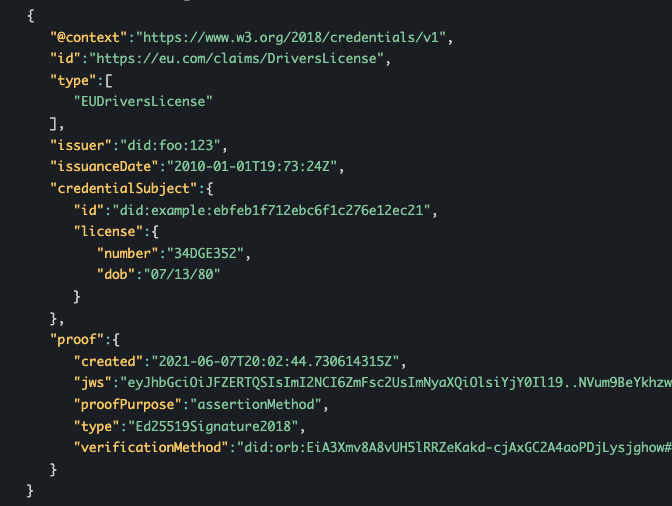

# BloXmove Dev : Verifiable Credential / Verifiable Presentation
### MinAge18Type, MinAge21Type, MinAge25Type
I could not find any VC's in a similar format. (e.g minAge18: true or minAge21: true) → maybe because of potential selective disclosure ?

W3.org (https://www.w3.org/TR/vc-imp-guide/#zero-knowledge-proofs ):

Using zero-knowledge methods, predicate proofs can be generated by the holder at the time of presentation without issuer involvement. For example, a verifiable credential with the claim birthdate can be used in a verifiable presentation to prove age-over-18. The same credential could then be used in another presentation to prove age-over-25, all without revealing the holder's birthdate.

All credentials regarding an age looked like this:

**driverLicenseType**

Also for driver’s license:

Sphereon library (based on https://identity.foundation/presentation-exchange/ )

1. Presentation → can have multiple requested and and from user selected VC's

2. One presentation is sent to the verifier

3. The user picks the requested VC's from his wallet and put it into the VP.

