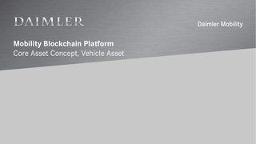
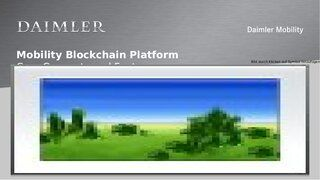
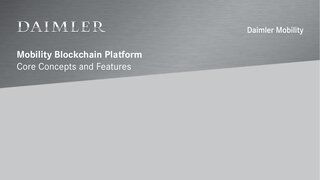

# BloXmove Dev : Core mechanisms

| Presentation  | Version       | Authors   |
| ------------- | ------------- |-----------|
| MBP 1.0 Core Concepts Extract with Focus on DID and Vehicle Asset | 2020-10-12  | [Jan-Paul Buchwald (Unlicensed)](https://bloxmove.atlassian.net/wiki/people/5a50d761e067544f89dbeeb1?ref=confluence)  |
| MBP v1.0 Core Concepts - Asset Architecture + DID/VC, KYC, Virtual Car Wallet, Contracting Flow, B2C + B2B Scenarios    | 2020-04-06  | [Jan-Paul Buchwald (Unlicensed)](https://bloxmove.atlassian.net/wiki/people/5a50d761e067544f89dbeeb1?ref=confluence)  |
| MBP 1.0 Core Concepts Extract with Focus on DID and Vehicle Asset | 2020-10-12  | [Jan-Paul Buchwald (Unlicensed)](https://bloxmove.atlassian.net/wiki/people/5a50d761e067544f89dbeeb1?ref=confluence)  |

