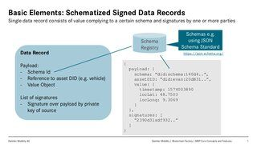

# BloXmove Dev : Safe Storage Module
The Safe Storage Module is an independent component of the MBP that can be used to efficiently store large amounts of data (e.g. raw telematics data from vehicles) off-chain and link them to on-chain timestamped proofs based on hash trees.

The basic idea, concept and examples are described in the following presentation.
| File | Version | Authors |
| ---- | ------- | ------- |
|  | DRAFT 2, 2020-04-16 | [Jan-Paul Buchwald (Unlicensed) harry.h.behrens@daimler.com (Unlicensed)](https://bloxmove.atlassian.net/wiki/people/5a50d761e067544f89dbeeb1?ref=confluence) |

