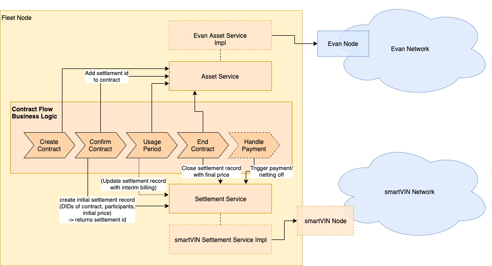
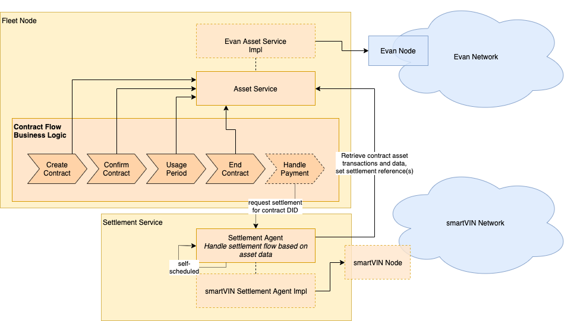

# BloXmove Dev : Settlement Process
The bloXmove platform should provide a pluggable, flexible settlement mechanism for tracking liabilities and allowing payment as well as netting between single parties involved in a business transaction. In order to provide a well-designed abstraction, the following alternatives are to be considered.

## Push to Settlement Service
### Principle
The business logic orchestrates calls to an abstract Settlement Service (library) at relevant parts of the flow and connects the settlement information to the asset layer by storing references in both ways. A particular smartVIN implementation of the Settlement Service would dispatch the calls to the respective operations on a smartVIN node.

### Schema

#### Pros

- Settlement information is pushed in realtime

- Business logic is in control of settlement
#### Cons

- Business Logic has a dependency on settlement details

- Since parts of the flow are duplicated, there is a risk of running out of sync between asset and settlement layer if business logic contains errors, expensive failure/retry management necessary

### Variants

Rather than implementing and integrating the Settlement Service as a (synchronous) library or API, it could also be implemented as or make use of a **Message Queue** to facilitate a more optimized asynchronous handling and simplified retry handling. The Business Logic could then essentially just push settlement related messages in a defined and standardized format into the queue.

## Pull with Settlement Agent
### Principle
The business logic only takes care of the transactions in the asset layer which provide a traceable record of all activities relevant for later settlement. An independent Settlement Agent regularly or upon explicit trigger fetches all required information from the asset layer, calculates the liabilities from that information, stores the liabilities in the settlement system, and sets references to the settlement transactions in the asset layer. A particular smartVIN implementation of the Settlement Agent would dispatch the calls to the respective operations on a smartVIN node.

### Schema

#### Pros

- Settlement process runs independently from business logic in an own transactional context

- Possible re-use of settlement logic across multiple scenarios

#### Cons

- Near-Realtime processing requires high frequency of pulling

- Settlement Agent is separate component or module that needs to be managed and maintained

### Variants
The Settlement Agent could be implemented as a
1._ stand-alone_ service or
2. as module within the fleet node
Number 1 has the advantage of possible re-use across components, but the disadvantage of operating a separate service.

## Interledger Synchronization
### Principle
Business Logic and settlement are completely separated components associated to a ledger (e.g. contract flow to the Evan ledger, settlement to the smartVIN/Corda ledger). The connection between the two spheres is established on the ledger level by exchanging core business facts in a standardized format (e.g. modelled as non-fungible tokens) using an interledger protocol like Cosmos. In the simple case the ledgers are connected through direct bilateral connections, in advanced scenarios an additional interledger network like Cosmos Hub can be used to connect more than two ledgers.

### Schema

#### Pros

- Maximum decoupling between business logic and settlement

- Approach can be relatively easily extended to other ledgers or business logic architectures (for integration with other Blockchain-based mobility platforms or ecosystem)

#### Cons

- Interledger solutions are “cutting-edge” technology, especially integration of permissioned networks like Corda are challenging and expensive to implement

