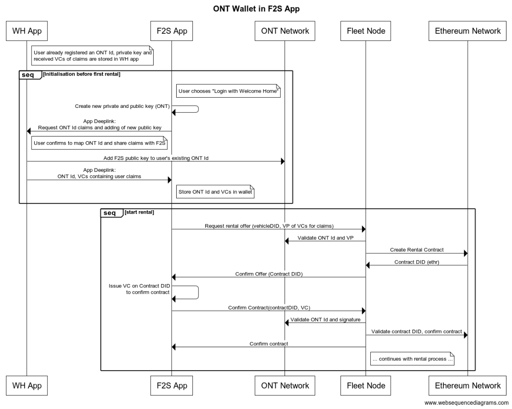

# BloXmove Dev : Universal Asset Service
## Using ONT ID for Service Consumer, Ethr DIDs for Other Components
The following assumes a scenario where the user / consumer of the rental service has an ONT Id, and all other entities Fleet Owner (with the Fleet Node backend service acting on its behalf), Vehicle, and Rental Contract are using Ethr DIDs. Further assumed is that the user uses a mobile app where the private key and certain VCs of its ONT Id are already stored, e.g. the Welcome Home App or a more general wallet app like ONTO.

The basic onboarding flow is then handled in the frontend generating a new ONT private/public key pair in the Fleet2Share app, then jumping to an ONT App to ask the new public key to be added to the existing ONT ID and the VCs to be returned to the Fleet2Share app, where the ONT ID and VCs are stored for later usage.

After the initial onboarding, the F2S App uses the ONT ID to request a rental, presenting the claims in a Verifiable Presentation to the Fleet Node. Using the Universal Asset Service, the Fleet Node recognises that the consumer uses an ONT ID and does the necessary validations and checks towards the ONT Network. The rental contract is handled on the Ethereum Network as the layer 1 of the service provider. When it gets to confirming the contract by the user, the F2S App creates a VC with the contract DID and the topic “consumerConfirm” as the subject issued by the ONT ID. This VC is then sent to the Fleet Node and stored as an attestation on the Ethereum Network Attestation Registry Smart Contract.

The same way, the remaining parts of the rental process are handled, with the F2S App always using the ONT ID for consumer confirmations or signatures, and the Fleet Node and Virtual Car Wallet recognising the ONT related DID based on the Universal Asset Service implementation.

## Asset Service Interface
The current asset service TypeScript definition can be found in GitHub: https://github.com/bloxmove-com/did-asset-library/blob/master/src/services/asset.service.ts

The following table lists the current operations and provides a basic specification how a support of multiple/different DID methods should be achieved.

It is assumed that the configuration of the component using the asset service (e.g. a backend service) must point to a particular account and DID, thus defining which DID method and related ledger network the “current account” uses.

| Operation | Specification | Prio |
| --------- | ------------- | ---- |
| init() | Calls init for all supported DID methods that require an initialization | 1 |
| createAsset(assetName, initialDataProperties, assetType?) → new asset DID | Asset created in same network as current account DID | 2 |
| addInvolvedParties(assetDID, involvedPartiesDIDs, permissions) addInvolvedPartiesByPublicKey(assetDID, involvedPartiesPublicKeys, permissions) | DID method of current account, asset and involved party must be the same, uses network according to this DID method New variant to add involved parties based on their public key Interface of permissions attribute is extended to contain different attributes of the DID document the involved party is added to (e.g. publicKey, authentication, controller, `recovery) | 3 |
| getInvolvedParties(assetDID) → DIDs getOwner(assetDID) → DID getDataProperty(assetDID, key, assetType?) → string | Uses network according to DID method of asset DID | 3 |
| createDataProperty(assetDID, key, value, assetType?, changable?) updateDataProperty(assetDID, key, value, assetType?) | DID method of current account and asset must be the same, uses network according to this DID method | 3
 | getAttestations(assetDID, topic) → list of attestation objects | Uses network according to DID method of asset DID | 1* |
| setAttestation(assetDID, topic, externalVC) | DID method of current account and asset must be the same, this determines the network where the attestation is stored | 3 | resolveName(name) → DID setName(name, assetDID) | Uses a global name service or namespace defined and governed by the Mobility Blockchain Platform that supports arbitrary name ↔︎ DID mappings, could be even made off-chain or permissioned for data privacy reasons | 3 |
| verifySignature(signerDID, message, signature) → boolean | Uses (default) signature method based on signer DID | 1 |
| signMessage(message) → string | Uses (default) signature and DID method of current account | 1 |
| isValidDID(assetDID) → boolean   getDIDDocument(assetDID) → JSON   setDIDDocument(didDocument) | Uses network according to DID method of asset DID | 2 | 
| createVerifiableCredential(type, credentialSubject, expirationDate?, proofPurpose?) → VC \| string \| createVerifiablePresentation(VC[] \| string[], expirationDate?, proofPurpose?) → VP \| string | Uses DID method of current account for the signer of the VC or VP, must support both JSON-LD (object) or JWT (string) VC and VP formats | 1 |
| isVerifiablePresentationValid(signerDID, VP) → boolean | Removed in favor of validateVerifiablePresentation (see below) | 1 |
| validateVerifiableCredential(VC \| string) → VC \| null | Validates the VC (can be both JSON-LD or JWT format) in terms of expiration, signature, and returns the VC object if the information is valid | 1 |
| validateVerifiablePresentation(VP \| string, expectedSignerDID) → VC[] | Validates the VP (can be both JSON-LD or JWT format) in terms of expiration and signatures, returns list of contained VC objects if valid | 1 |

***priority only relates to the Ethereum network**

All priority 1 elements have been implemented as part of the moveX@ONT scenario for the Startup Autobahn Expo Day in September 2020. Priority 2 and 3 elements are implemented in the Universal Asset Service, but mostly missing the implementation in the Ontology Asset Service and thus would not work if called for an ONT DID.
